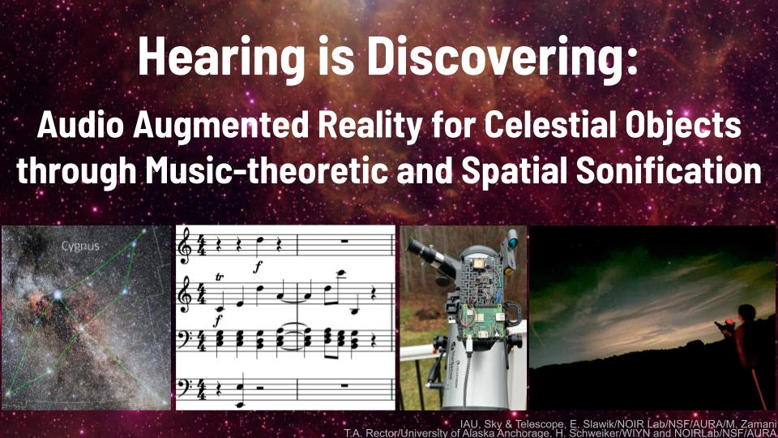

  

## Project Summary

This project advances audio augmentation in augmented reality (AR) by developing a spatial sonification method grounded in music theory. Although AR is increasingly prevalent in education and entertainment, most research and applications rely almost exclusively on visual augmentation, with limited use of meaningful audio. Using astronomy as a testbed, this project addresses the gap by augmenting celestial objects such as constellations with musical representations sonified directly from their astronomical features (e.g., position on the celestial sphere, area/size, brightness, and local deep-sky objects). 

By translating astronomical data into musically coherent compositions based on music-theoretic principles (e.g., tonality and functional harmony), the method allows learners to perceive and explore celestial objects through auditory modalities. An accompanying AR device extends this experience beyond the classroom by supporting immersive interaction with celestial objects under the night sky through a virtual spatial soundscape. The device performs real-time object identification and audio-guided search by rendering three-dimensional sounds that appear to originate from celestial objects.

A user study with 116 participants shows that the method is effective even for novices, with consistently high accuracy across recognition tasks (92-93%). Participants also exhibit a 68 percentage-point increase in perceived connection between constellations and their music, with 91% reporting enjoyment, 77% expressing increased motivation to learn more about astronomy, and 85% agreeing that audio-visual integration enhances learning. Field testing demonstrates the feasibility of the integrated AR system, including reliable constellation identification and search, responsive spatial audio rendering, and immersive audio-guided exploration under nighttime observation conditions.

## Awards

- 2026 International Science & Engineering Fair (ISEF):
    - 4th Place Grand Award in Software Design
    - 4th Place ACM (Association for Computing Machinery) Special Award
- 2026 Massachusetts Science & Engineering Fair (MSEF):
    - 1st Place (MathWorks First Place Award)

## Presentations

4th Grand Prize in Software Design

and 4th ACM (Association for Computing Machinery) Special Award, International Science & Engineering Fair (ISEF), May 2026; 1st Place (MathWorks First Place Award), Massachusetts Science & Engineering Fair (MSEF), April 2026.

